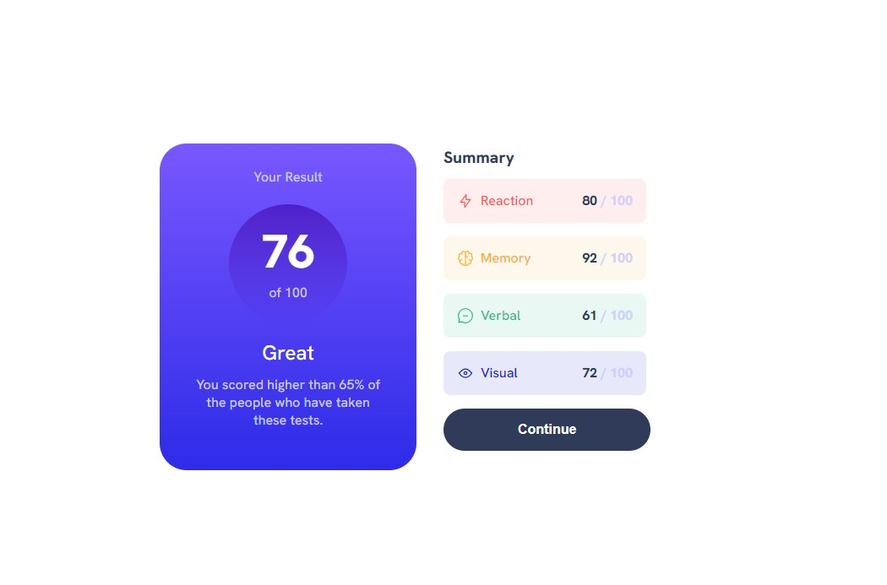
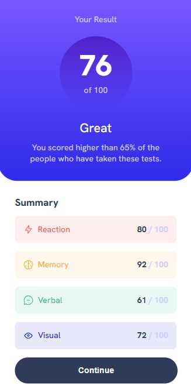

# Frontend Mentor - Results summary component solution

This is a solution to the [Results summary component challenge on Frontend Mentor](https://www.frontendmentor.io/challenges/results-summary-component-CE_K6s0maV). Frontend Mentor challenges help you improve your coding skills by building realistic projects.

## Table of contents

- [Overview](#overview)
  - [The challenge](#the-challenge)
  - [Screenshot](#screenshot)
  - [Links](#links)
  - [Author](#author)

## Overview

### The challenge

Users should be able to:

- View the optimal layout for the interface depending on their device's screen size
- See hover and focus states for all interactive elements on the page

### Screenshot

### Links

- Solution URL: [https://github.com/TomLi0421/results-summary-component](https://github.com/TomLi0421/results-summary-component)
- Live Site URL: [https://tomli0421.github.io/results-summary-component/](https://tomli0421.github.io/results-summary-component/)

## My process

### Built with

- Semantic HTML5 markup
- CSS custom properties
- Position
- Flexbox
- Mobile-first workflow

## Author

- Personal Website - [https://tomli0421.github.io/Personal-site/](https://tomli0421.github.io/Personal-site/)
- GitHub - [TomLi0421](https://github.com/TomLi0421)
- Frontend Mentor - [@TomLi0421](https://www.frontendmentor.io/profile/TomLi0421)
